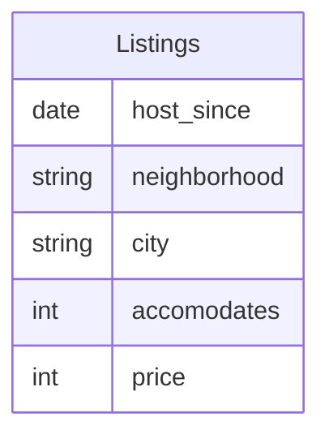

# Airbnb Analysis

## The Background & Objective
Airbnb is an online marketplace that connects people looking to rent out their homes with those seeking short-term lodging, offering a wide range of unique accommodations around the world.

The **objective** of this project is to find out to what extent the 2015 regulations in Paris had an impact on Airbnb.

(To know more about these regulations check out this article on [Hostaway Blog Post](https://www.hostaway.com/blog/airbnb-and-short-term-rental-regulations-in-paris/)) 

## The Dataset
The AirBnb dataset can be found on Maven Analytics website [here](https://app.mavenanalytics.io/guided-projects/4fee7ee7-4c04-46e7-9f3e-99b987980842).

For analysis of the objective, I have used only the following columns from the Listings.csv file:

## Analysis
### Average Price by Neighborhood in Paris

### Average Price by Accommodation Capacity

We would expect that the listing which can accommodate the most people should be the most expensive, but from the above chart it is not the case. It is interesting to see that the Airbnb listing which can accommodate 16 people has an average price lower than listings which can accommodate 11, 13 or 14 people by a margin of almost up to €200.

### Impact of the 2015 Regulations on New Hosts & Prices 

## Conclusion
From the above graphs, we can see that until 2015, the number of AirBnB hosts significantly increased. This was before the regulations. Since there were so many AirBnB options, we can also see that the average price of each listing steadily decreased until 2015.

After 2015, the introduction of new regulations in Paris led to a sharp decline in the number of Airbnb listings. As the number of new listings decreased, the average price per listing rose steadily, a trend that persisted until 2020. However, post-2020, both the number of listings and average prices experienced a further decline, likely influenced by the impact of the COVID-19 pandemic.